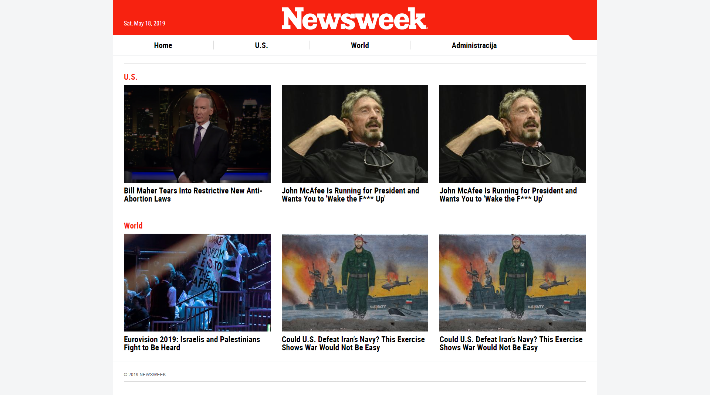
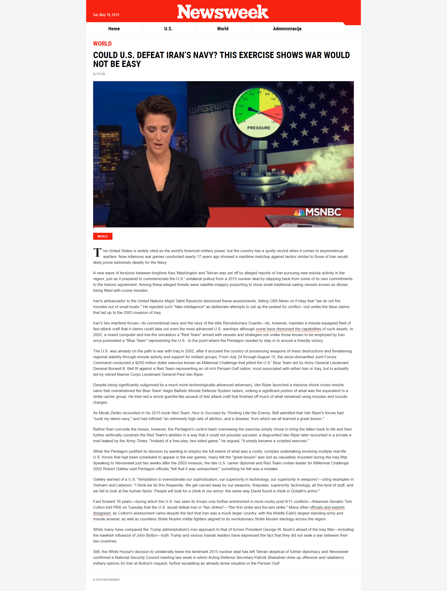

# Projekt za PWA

Newsweek portal s pregledom vijesti, registracijom, prijavom i administracijom sadržaja.

[GitHub repozitorij](https://github.com/mstankovi/PWA-projekt)

## Referentni izgled

Stranica je napravljena prema sljedećim primjerima početne stranice i prikaza članka.

### Početna stranica



### Članak



## Upute

1. Kopirajte projekt u XAMPP direktorij `htdocs` ili napravite junction (Windows):

```powershell
New-Item -ItemType Junction -Path "C:\xampp\htdocs\newsweek" -Target "[VAS DIREKTORIJ]"
```

2. U XAMPP Control Panelu pokrenite Apache i MySQL.
3. U phpMyAdminu uvezite datoteku (Import) `database.sql`.
4. Otvorite `http://localhost/newsweek/`.

Administratorski račun:

```text
Korisničko ime: admin
Lozinka: Admin123!
```
